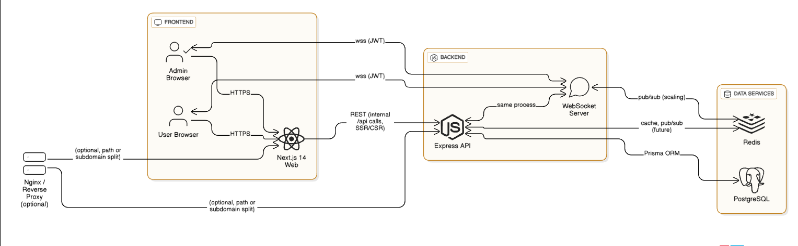

# E2E - Modern Realtime Chat Starter

<p align="center">
  <strong>Opinionated, extensible, batteries‑included starter for building a WhatsApp‑class messaging product.</strong><br/>
  Realtime • TypeScript • Prisma • Next.js • Redis • WebSockets • Dark Mode • Admin tooling
</p>

<p align="center">
  <!-- Badges (replace placeholders when CI/CD added) -->
  <a href="#"></a>
  <a href="#"></a>
  <a href="#stack"></a>
</p>

---

## 🚀 Quick Start

```bash
# Start infra (Postgres + Redis) & run both server + web
docker compose up -d \
  && (cd server && cp -n .env.example .env && npm i && npx prisma generate && npm run prisma:migrate -- --name init || true && npm run dev &) \
  && (cd web && ([ -f .env.local ] || echo "NEXT_PUBLIC_API_URL=http://localhost:4000" > .env.local) && npm i && npm run dev &)
```
Then open:
- API: http://localhost:4000/health
- Web: http://localhost:3000

Optional admin bootstrap (add before starting server):
```env
# server/.env additions
ADMIN_PHONE=+***************
ADMIN_PASSWORD=StrongAdminPass!
JWT_SECRET=CHANGE_ME_LONG_RANDOM_STRING
```
Login with that phone/password → you land in /admin.

Minimal manual (two terminals) if you prefer:
```bash
# Terminal 1
docker compose up -d
cd server && cp .env.example .env && npm i && npx prisma generate && npm run prisma:migrate -- --name init && npm run dev
# Terminal 2
cd web && echo "NEXT_PUBLIC_API_URL=http://localhost:4000" > .env.local && npm i && npm run dev
```
Create two users in different browsers → open Chat → send messages.

---

## ✨ Feature Highlights

**Core**
- ⚡ Realtime WebSocket delivery & live user events
- 💬 1:1 conversations with cursor (keyset) pagination
- 📦 Structured receipts (delivered/read) – extensible to reactions & edits
- 🧩 Modular Prisma schema ready for groups & media

**UX / Frontend**
- 🌓 Zero‑flicker dark mode (class strategy + cross‑tab sync)
- 📱 Adaptive layout (desktop split / mobile focus + collapsible list)
- 🎨 Modern marketing hero, animated gradients, stats & feature grid
- ♿ Progressive enhancement friendly (server + client hydration)

**Infra / Ops**
- 🗄 Postgres 16 + Prisma 5
- 🔁 Redis 7 prepared (pub/sub, presence, fanout, caching)
- 🪵 Structured logging (pino) with HTTP binding
- 🛠 Typed validation boundary (zod) for all auth payloads

**Security / Future E2E**
- 🔐 JWT (7d) + bcrypt hashes
- 🛡 Admin bootstrap (env or first user) + role‑guarded routes
- 🧪 Ciphertext column ready for libsignal (currently base64 placeholder)
- 🔄 Fields for receipts to drive encrypted status updates later

> Designed so you can incrementally add: groups, media (S3), presence, push notifications, full E2E sessions.

## 🧱 Tech Stack <a id="stack"></a>
| Layer | Tech | Notes |
|-------|------|-------|
| UI | Next.js 14, React 18 | App Router, SSR/ISR ready |
| Styling | Tailwind CSS | Utility-first, dark mode via class |
| State/Data Fetch | SWR | Simple cache layer for REST endpoints |
| API | Express | Thin, typed handlers w/ zod |
| Realtime | ws (WebSocket) | Auth via JWT query param |
| ORM / DB | Prisma + PostgreSQL | Migration history included |
| Cache / Fanout | Redis (ioredis) | Future pub/sub + presence |
| Auth | JWT (HS256), bcrypt | Replace/rotate secret in prod |
| Validation | zod | Runtime schema → TS inference |
| Logging | pino / pino-http | Structured JSON logs |

<details>
<summary><strong>Version Matrix</strong></summary>

```text
Node:        >=18
Next.js:     14.x
Prisma:      5.18.x
PostgreSQL:  16
Redis:       7
TypeScript:  5.5+
```
</details>

## 🏗 Architecture Overview




**Frontend Layer:**
- Admin and User browsers interact with Next.js 14 web app via HTTPS
- WebSocket connections (wss) established for realtime messaging, authenticated via JWT
- React UI with hooks for state management, SWR for REST API calls

**Backend Layer:**
- Express API handles REST endpoints (auth, user directory, conversations, admin operations)  
- WebSocket server (same process) manages realtime events and message fanout
- JWT authentication and Zod validation for all API requests
- Structured logging with pino for observability

**Data Layer:**
- PostgreSQL stores users, conversations, and messages (via Prisma ORM)
- Redis supports caching, pub/sub for scaling, and future presence/queue fanout
- Cursor-based pagination for efficient message and user list queries


### Component Responsibilities
| Component | Responsibility | Scaling Strategy |
|-----------|----------------|------------------|
| REST Layer | Auth, directory, pagination, conversation bootstrap | Stateless replicas |
| Realtime Gateway | WS auth, message persist + fanout, receipts | Sticky sessions + Redis pub/sub |
| PostgreSQL | Durable store (users, messages, conversations) | Read replicas → partition as growth |
| Redis | Ephemeral cache, future presence, queue fanout | Cluster / sharding |
| Reverse Proxy | TLS termination, compression, routing | Edge POP / CDN |
| Next.js | UI rendering, hydration, prefetch | Incremental / edge caching |

### Evolution Path
- Extract directory/auth/chat into services when vertical scaling plateaus.
- Introduce Redis pub/sub channels for multi-node message propagation.
- Add Notification worker (push/email) consuming Redis streams.
- Layer E2E session management before multi-device expansion.

## 🔄 Data Flow (Send Message)
1. Client ensures conversation (GET /conversations/:peerId) → receives `conversationId`.
2. Client encrypts plaintext (future: libsignal) → base64 ciphertext now.
3. Client emits WS `{ type: 'send-message', toUserId, ciphertext, conversationId? }`.
4. Server persists message (Prisma) and forwards over WS to recipient.
5. Recipient writes to local state; can emit receipt `{ type: 'receipt', messageId, kind: 'delivered' }`.
6. Sender updates local delivery status, later `read` receipt.

## 🗂 Project Structure
```text
server/  (Express + WebSocket + Prisma)
web/     (Next.js UI + marketing + chat)
docker-compose.yml (dev infra: Postgres + Redis)
```
Detailed tree earlier retained for reference.

## 📦 Data Model (Simplified)
```text
User { id, phone, displayName, passwordHash, identityKey, preKeys, isAdmin, createdAt }
Conversation { id, aId, bId, createdAt }
Message { id, conversationId, senderId, receiverId, ciphertext(bytes), deliveredAt, readAt, createdAt }
```
- 1:1 conversation uniqueness: sorted pair of user IDs
- Placeholder encryption: plaintext→base64; ready for real ciphertext

## 🔐 Environment Variables
Server `.env`:
```env
DATABASE_URL=postgresql://app:app@db:5432/app?schema=public
REDIS_URL=redis://redis:6379
JWT_SECRET=change-me-long-random
ADMIN_PHONE=+*******     # Optional bootstrap
ADMIN_PASSWORD=StrongAdminPass!# Optional bootstrap
LOG_LEVEL=info
```
Web `.env.local`:
```env
NEXT_PUBLIC_API_URL=http://localhost:4000
NEXT_PUBLIC_WS_URL=ws://localhost:4000
```
Notes:
- First registered user becomes admin unless matching ADMIN credentials login first.
- Replace `JWT_SECRET` in production.

## 🚀 Local Development
Prereqs: Docker, Node 18+

1. Start infra (Postgres + Redis)
```
docker compose up -d
```
2. Server
```
cd server
cp .env.example .env   # edit if needed
npm install
npx prisma generate
npm run prisma:migrate -- --name init   # first time
npm run dev                              # http://localhost:4000
```
3. Web
```
cd web
echo "NEXT_PUBLIC_API_URL=http://localhost:4000" > .env.local
npm install
npm run dev                               # http://localhost:3000
```

## 🧪 Key Scripts
Server:
- `npm run dev` – tsx watch
- `npm run build` – compile TypeScript
- `npm start` – run compiled dist
- `npm run prisma:migrate` – dev migration
- (Add in prod) `prisma migrate deploy` before start

Web:
- `npm run dev` – Next dev
- `npm run build` – Production build
- `npm start` – Next standalone server

## 🌐 REST API Summary
Base URL: `http://localhost:4000`

Auth:
- `POST /auth/register` { phone, displayName, password, identityKey, preKeys? }
- `POST /auth/login` { phone, password }

Users & Admin:
- `GET /users` (auth) list other users (excludes self + bootstrap admin)
- `GET /users/:phone` (auth) public key lookup
- `GET /admin/users` (admin) paginated list
- `DELETE /admin/users/:id` (admin) delete user + cascade messages/conversations

Conversations & Messages:
- `GET /conversations/:peerId` (auth) ensure/retrieve conversationId
- `GET /conversations/:peerId/messages?cursor=&limit=` (auth) reverse chronological pagination

Health:
- `GET /health` → { ok: true }

## 🔌 WebSocket Events
Client→Server:
```json
{ "type":"send-message", "toUserId":"...", "conversationId":"?", "ciphertext":"base64" }
{ "type":"receipt", "messageId":"...", "kind":"delivered|read" }
```
Server→Client:
```json
{ "type":"ready" }
{ "type":"message", "message":{ ... } }
{ "type":"receipt", "messageId":"...", "kind":"delivered" }
{ "type":"user-registered", "user":{ ... } }
```

## 🛠 Admin Dashboard
Bootstrap admin → manage users → delete (safe guard only-admin). Admin link omitted for non-admin users.

## 🎨 UX Highlights
- Mobile first collapsible list
- No layout shift dark-mode hydration
- Animated marketing hero & gradient orbs

## ⚙️ Performance / Scaling Notes
| Area | Current | Next Step |
|------|---------|-----------|
| WebSocket fanout | In-memory maps | Redis pub/sub broadcast |
| Message pagination | Cursor (createdAt+id) | Composite index tuning / keyset pagination |
| N+1 avoidance | Minimal queries | Add dataloader if expanding relational depth |
| Static assets | Next optimized | CDN (images / future media) |
| Cold start | Lightweight | Container image slim + build cache layers |

## 🔐 Security Checklist
- [ ] Replace `JWT_SECRET` with strong 48+ char secret
- [ ] Restrict CORS origins (`cors({ origin: [...] })`)
- [ ] Add helmet middleware
- [ ] Add rate limiting (express-rate-limit + Redis store)
- [ ] Enforce HTTPS behind proxy
- [ ] Remove first-user auto-admin after provisioning
- [ ] Log audit events (deletions, admin actions)
- [ ] Implement session revocation (token versioning)
- [ ] Integrate real E2E (libsignal)

## 🛡 E2E Roadmap (Planned)
1. Identity + signed prekeys (client)  
2. Publish bundle → server  
3. Session init on first contact  
4. Store only ciphertext (already)  
5. Receipts remain metadata only  
6. Rekey & forward secrecy rotation  
7. Multi-device key management  

## 📦 Production Deployment Outline
1. Add Dockerfiles (multi-stage) for `server` & `web`  
2. Create `docker-compose.prod.yml` (db, redis, server, web, reverse proxy)  
3. Run `prisma migrate deploy` on startup  
4. TLS via Caddy (auto) or Nginx + certbot  
5. Enable security checklist items  
6. Add observability (structured logs, metrics, traces)  

## ♻️ Scaling Path
- Multi-instance WS nodes + Redis pub/sub
- Presence & typing channels (Redis sets / streams)
- Media storage via S3 + presigned URLs
- Archival / cold storage for aged messages

## 🧭 Extension Ideas
- Group chats (participants table)
- Message reactions / edits / deletes
- Push notifications (Web Push / FCM)
- Threaded replies / quoting
- Search (Postgres full-text or Meilisearch)
- Multi-device session sync

## 🧪 Testing Strategy

## 📜 License
MIT (add LICENSE file). Adjust if proprietary needs.


